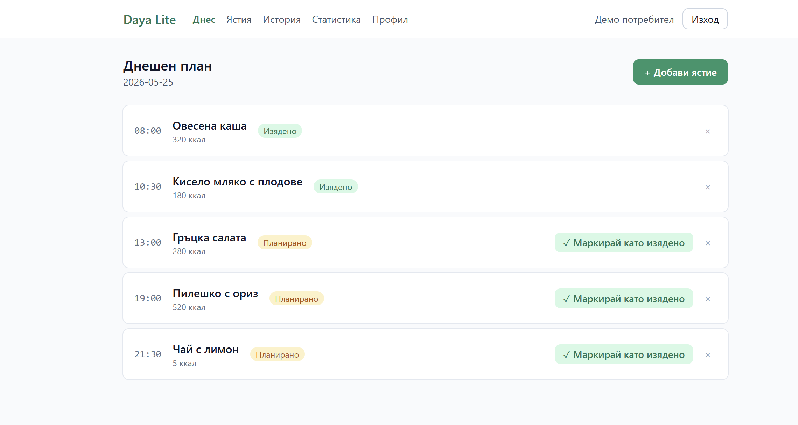
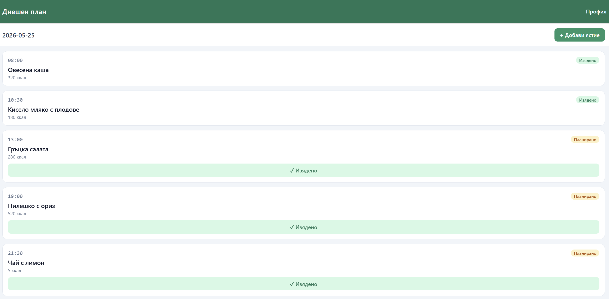
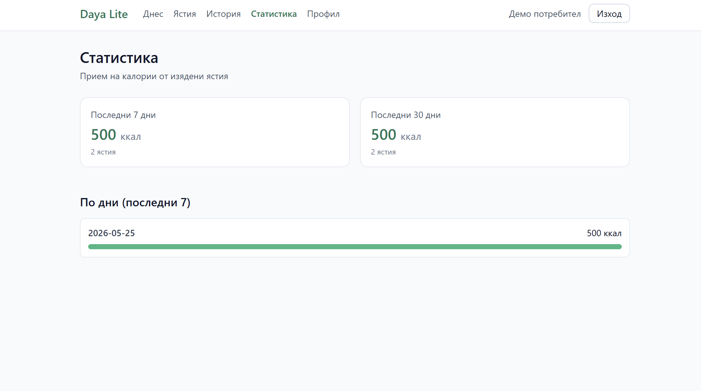

# Daya Lite

Personal daily meal planner — capstone project for SoftUni's **"Full-Stack Apps with AI"** course (March 2026 cohort). Submission deadline: **2026-05-27**.

A multi-platform full-stack app (Next.js + Expo + Neon Postgres) where a user can keep a personal meal catalog, plan meals per day, mark them eaten/skipped, and track calorie intake.

## Live URLs

| Component | URL |
|---|---|
| Web app (Next.js) | https://daya-lite.netlify.app |
| Mobile app (Expo Web) | https://daya-lite-mobile.netlify.app |
| API docs | https://daya-lite.netlify.app/api/docs |

## Screenshots

| | |
|---|---|
| **Днешен план** (web)<br> | **Ястия с paging** (web)<br> |
| **Статистика** (web)<br> | **Мобилно приложение**<br> |

## How to test as examiner

Sample credentials are delivered privately alongside the capstone submission.
Substitute them below as `<EMAIL>` / `<PASSWORD>` and `<ADMIN_EMAIL>` / `<ADMIN_PASSWORD>`.

### Web (https://daya-lite.netlify.app)

1. Open the landing page → click **Регистрация** to see the form (or skip; demo accounts already exist).
2. Click **Вход**, enter the regular `<EMAIL>` / `<PASSWORD>` → lands on `/dashboard`.
3. On **Днес**, you'll see today's plan with 5 sample meals. Click a meal to mark it eaten / skipped.
4. Go to **Ястия** — paginated meal catalog. New accounts start with 8 starter meals; the regular demo account has more for paging review. Click `+ Добави ястие` to create a new one, edit it, delete it. Use `Напред →` / `← Назад` if there are multiple pages.
5. Go to **История** for the last 30 daily plans with eaten/total ratio.
6. Go to **Статистика** for 7- and 30-day calorie totals + per-day bars.
7. Go to **Профил** to see account details (Изтрий акаунт is destructive — skip unless testing).
8. Logout via **Изход** (top-right).
9. Login again with `<ADMIN_EMAIL>` / `<ADMIN_PASSWORD>`. A new **Админ** link appears in the nav. Visit it to see all users; you can delete any non-self account.

### Mobile (https://daya-lite-mobile.netlify.app)

1. Open the URL → login with the same regular user credentials.
2. You're on **Днешен план** with the same 5 sample meals (data is shared with web).
3. Tap **+ Добави ястие** to create a meal.
4. Tap **Профил** (top-right) to see account info, then **Изход** to log out.

### Automated smoke test

A 12-check end-to-end script verifies the production API:

```bash
SMOKE_PASSWORD=<PASSWORD> npm run smoke
```

It checks login, JWT, paged meals, plans, CORS headers, auth guard (401) and authz guard (403), and `/api/docs`. Exits with non-zero on any failure — suitable for CI.

## Demo credentials

Sample accounts are seeded by `npm run db:seed`. The exact credentials are
provided privately to the grading team alongside the capstone submission —
they are intentionally not published here so casual visitors cannot log in
with elevated (admin) privileges on the live site.

You can always register a fresh account at `/register` to explore the app.

## Tech stack

| Layer | Choice |
|---|---|
| Web + backend | Next.js 15 (App Router, TypeScript) |
| Mobile | Expo + React Native + TypeScript (web export deployed) |
| Database | Neon serverless PostgreSQL |
| ORM / migrations | Drizzle ORM + Drizzle Kit |
| Styling | Tailwind CSS (web), StyleSheet (mobile) |
| Auth | Custom JWT (`jose`) — httpOnly cookie on web, `Authorization: Bearer` on mobile |
| Hashing | bcryptjs |
| Hosting | Netlify (web + mobile web export) + Neon (DB) |

## Architecture

```
┌────────────────┐  cookie  ┌──────────────────────┐  Drizzle  ┌──────────┐
│ Web (Next.js)  │ ───────▶ │ Next.js API routes   │ ────────▶ │ Neon DB  │
│ React+Tailwind │          │ /api/auth, /meals,   │           │ Postgres │
└────────────────┘          │ /plans, /logs,       │           └──────────┘
                            │ /admin, /users/me,   │
┌────────────────┐  Bearer  │ /docs                │
│ Mobile (Expo)  │ ───────▶ │                      │
│ React Native   │  HTTPS   └──────────────────────┘
└────────────────┘
```

- **Monorepo** with npm workspaces: `apps/web`, `apps/mobile`, `packages/shared`.
- **Single source of truth** for DB schema and shared types in `packages/shared`.
- Web uses **Server Components** for data fetching; only forms/interactive parts are client components.
- Mobile is a **thin REST client** — it never touches Neon directly.
- CORS for the mobile app is handled by per-route `OPTIONS` exports (`apps/web/lib/cors.ts`) + `next.config.ts` headers. Middleware is avoided due to a Netlify+Next 15.5 edge runtime incompatibility.

## Web app — 10 screens

| Route | Purpose |
|---|---|
| `/` | Landing → meta-redirect to `/login` |
| `/about` | Public project info page |
| `/login` | Login form (httpOnly cookie session) |
| `/register` | Register + auto-login |
| `/dashboard` | Today's plan: list, plan from catalog, mark eaten/skipped |
| `/meals` | Personal meal catalog: paginated CRUD (20/page) |
| `/plans` | History: last 30 daily plans with eaten/total ratio |
| `/stats` | Calorie totals for last 7 / 30 days + per-day bars |
| `/profile` | Profile view + self-delete (password confirmation) |
| `/admin` | Admin-only: user list + delete user |

All pages are responsive (Tailwind utility classes). UI text lives in `apps/web/lib/messages.ts` (Bulgarian, i18n-ready).

## Mobile app — 5 screens

| Route | Purpose |
|---|---|
| `(auth)/login` | Login → stores Bearer token + user |
| `(auth)/register` | Register + auto-login |
| `(app)/index` | Today's plan |
| `(app)/add-meal` | Add a new meal to the catalog |
| `(app)/profile` | Profile + logout |

## Database schema (4 tables, all CASCADE)

```
users
 ├─ meals          (user_id, btree index for paging)
 ├─ daily_plans    (user_id; UNIQUE per user+plan_date)
 │   └─ meal_logs  (plan_id; references meals)
```

| Table | Key columns |
|---|---|
| `users` | `id`, `email` (unique), `password_hash`, `name`, `role` (`user`\|`admin`), `created_at` |
| `meals` | `id`, `name`, `description?`, `calories?`, `user_id` → users, `created_at`, idx on `user_id` |
| `daily_plans` | `id`, `user_id`, `plan_date`, `notes?`, timestamps. UNIQUE (`user_id`, `plan_date`) |
| `meal_logs` | `id`, `plan_id`, `meal_id`, `scheduled_time` (`HH:MM`), `status` (`planned`\|`eaten`\|`skipped`), `eaten_at?` |

Schema: [`packages/shared/src/db/schema.ts`](packages/shared/src/db/schema.ts).
SQL migration: [`packages/shared/src/db/migrations/0000_dizzy_mockingbird.sql`](packages/shared/src/db/migrations/0000_dizzy_mockingbird.sql).

## Scalability

- `/meals` paginates server-side (20/page), with `Страница X от Y` indicator and prev/next links.
- `GET /api/meals?page=N&pageSize=M` returns `{ data, pagination: { page, pageSize, total, totalPages } }`.
- Btree index on `meals.user_id` speeds up the per-user filter.
- `scripts/seed-bulk.mjs` is an optional script that bulk-inserts a large dataset for the demo user (batched 500/row) so paging behaviour can be validated against realistic load: `npm run db:seed:bulk`.

## Auth & authorization

- JWT signed with HS256 (`jose`), 7-day expiry, payload = `{ sub, email, role }`.
- Web: httpOnly cookie `daya_token`, set with `Secure; SameSite=lax`.
- Mobile: token returned in `/api/auth/login` response body, stored in `expo-secure-store`, sent as `Authorization: Bearer`.
- Server-side guards: `getSession()` reads either cookie or Bearer; `app/(app)/layout.tsx` redirects unauthenticated users; `/admin` route additionally checks `session.role === 'admin'`.

## API quick reference

| Group | Endpoints |
|---|---|
| Auth (3) | `POST /api/auth/{register,login,logout}` |
| Meals (5) | `GET`/`POST` `/api/meals` (paginated), `GET`/`PUT`/`DELETE` `/api/meals/:id` |
| Plans (4) | `GET`/`POST` `/api/plans`, `GET` `/api/plans/:date`, `PUT` `/api/plans/:id` |
| Logs (4) | `POST` `/api/logs`, `PUT`/`DELETE` `/api/logs/:id`, `PATCH` `/api/logs/:id/eat` |
| Admin (3) | `GET` `/api/admin/users`, `GET`/`DELETE` `/api/admin/users/:id` |
| Self (1) | `DELETE` `/api/users/me` (password in body) |

**18 total.** Full schema and response shapes at [`/api/docs`](https://daya-lite.netlify.app/api/docs).

## Local development

### Prerequisites
- Node.js 20+, npm 10+
- A free [Neon](https://neon.tech) account

### Setup
```bash
git clone https://github.com/DMY76657/Daya-Lite.git
cd Daya-Lite
npm install --legacy-peer-deps
```

### Environment

Root `.env`:
```env
DATABASE_URL="postgresql://...your Neon connection string..."
JWT_SECRET="...generate: node -e \"console.log(require('crypto').randomBytes(64).toString('hex'))\"..."
JWT_EXPIRES_IN="7d"
```

`apps/mobile/.env`:
```env
EXPO_PUBLIC_API_BASE_URL=https://daya-lite.netlify.app/api
```

### Database
```bash
npm run db:push          # sync schema with Neon
npm run db:seed          # 2 demo users + sample meals
npm run db:seed:bulk     # optional: bulk-insert for paging/scalability tests
npm run db:studio        # browse data
```

### Run apps
```bash
npm run dev:web          # http://localhost:3000
npm run dev:mobile       # Expo dev server (scan QR with Expo Go)
```

## Repository layout

```
apps/
  web/                   Next.js 15 web app + REST API
    app/                 App Router routes
      (auth)/            /login, /register
      (app)/             /dashboard, /meals, /plans, /stats, /profile, /admin
      about/             /about (public)
      api/               14 endpoint folders
    components/          Client components (forms, lists)
    lib/                 auth, db, validation, cors, messages
  mobile/                Expo (React Native) app
    app/                 expo-router screens
    lib/                 api client, secure-store wrappers
packages/
  shared/                Drizzle schema + shared TS types
    src/db/migrations/   Committed SQL migrations
scripts/
  seed.mjs               Demo user + sample data
  seed-bulk.mjs          Optional bulk-insert for paging/scalability tests
AGENTS.md                AI dev agent instructions
drizzle.config.ts        Drizzle Kit config
netlify.toml             Web app deploy config
```

## License

Private capstone project — not licensed for redistribution.
